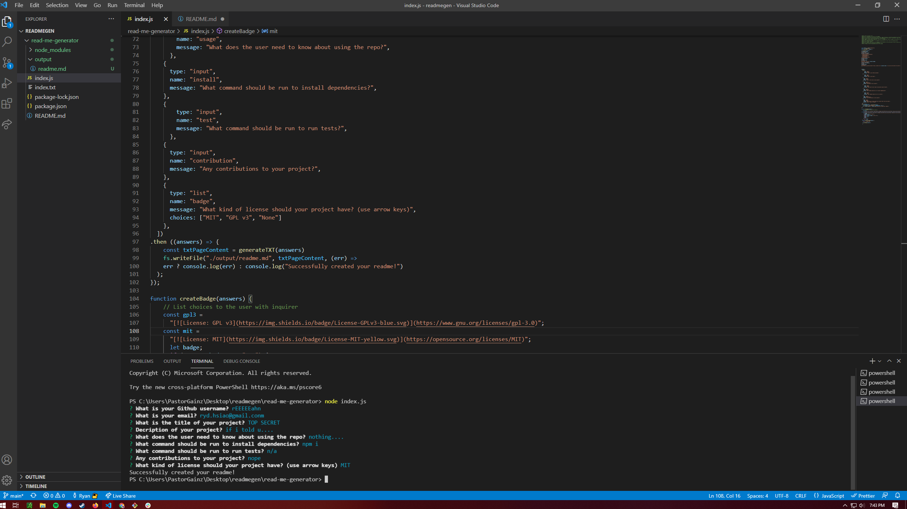
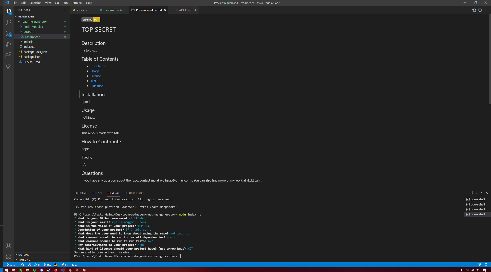

# <Read-Me-Generator>
## Description
This repo is a Readme Generator. Allows user to create a read me through node. I learned how to use inquirer to get user information. As well as creating a read me through only javascript.

## Installation
Started with npm and getting inquirer to get user input. After getting user input it was just creating the template for the read me then adding it to the js.
## Usage
questions appear in terminal.

results found in output folder.

## Credits
inquirer - https://www.npmjs.com/package/inquirer
npm - https://www.npmjs.com/
## License
MIT License

Copyright (c) [2021] [RyanHsiao]

Permission is hereby granted, free of charge, to any person obtaining a copy
of this software and associated documentation files (the "Software"), to deal
in the Software without restriction, including without limitation the rights
to use, copy, modify, merge, publish, distribute, sublicense, and/or sell
copies of the Software, and to permit persons to whom the Software is
furnished to do so, subject to the following conditions:

The above copyright notice and this permission notice shall be included in all
copies or substantial portions of the Software.

THE SOFTWARE IS PROVIDED "AS IS", WITHOUT WARRANTY OF ANY KIND, EXPRESS OR
IMPLIED, INCLUDING BUT NOT LIMITED TO THE WARRANTIES OF MERCHANTABILITY,
FITNESS FOR A PARTICULAR PURPOSE AND NONINFRINGEMENT. IN NO EVENT SHALL THE
AUTHORS OR COPYRIGHT HOLDERS BE LIABLE FOR ANY CLAIM, DAMAGES OR OTHER
LIABILITY, WHETHER IN AN ACTION OF CONTRACT, TORT OR OTHERWISE, ARISING FROM,
OUT OF OR IN CONNECTION WITH THE SOFTWARE OR THE USE OR OTHER DEALINGS IN THE
SOFTWARE.
---